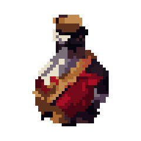
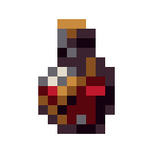
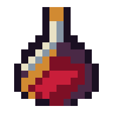

<p align="center">
  <picture>
    <source media="(prefers-color-scheme: dark)" srcset="https://shieldcn.dev/header/document.svg?title=Pixel+Art+HTML&subtitle=Craft+the+grid.+Prove+every+cell.&logo=grid3x3&theme=red&align=center&mode=dark" />
    
  </picture>
</p>

<p align="center">
  <a href="https://github.com/gvastethecreator/pixel-art-html-skill/actions/workflows/ci.yml"></a>
  <a href="https://gvastethecreator.github.io/pixel-art-html-skill/"></a>
  <a href="https://www.python.org/"></a>
  <a href="https://skills.sh/gvastethecreator/pixel-art-html-skill/pixel-art-html"></a>
  <a href="LICENSE"></a>
</p>

> Codex skill for creating exact-grid pixel art and self-contained HTML artifact libraries without calling a model API.

Pixel Art HTML turns text-authored grids, local images, or accepted Codex ImageGen outputs into deterministic JSON, PNG, and standalone HTML. Its craft loop builds silhouette, projection, value, light, palette, and material clusters before detail. Managed builds are stored as chronological project iterations and automatically indexed in a dark, local-first gallery.

[Project site](https://gvastethecreator.github.io/pixel-art-html-skill/) · [Skill workflow](./SKILLS/pixel-art-html/SKILL.md) · [Contributing](./CONTRIBUTING.md) · [Sponsor](https://github.com/sponsors/gvastethecreator)

## Shipped examples

These are committed skill fixtures, not newly generated maintenance art.

| Cursed potion | Hook key |
| --- | --- |
|  |  |
| **Automatic 16×16 recovery** | **Authored 16×16 repair** |
|  |  |

- Build single images or deliberate multi-resolution sets from 8x8 through 128x128.
- Classify exact-grid, pseudo-pixel, and painterly sources before conversion, then record the detector, confidence, inferred lattice, and applied reconstruction in canonical metadata.
- Convert locally with Pillow using target-aware structure/color packing while enforcing exact dimensions and palette limits.
- Repair losing 8x8/16x16 drafts through a declarative authored spec that preserves the exact baseline, required silhouette/identity/subtraction decisions, changed-cell evidence, and blind before/after proof.
- Reuse exact cluster motifs with flips and palette maps instead of scattering one-off pixels.
- Author only fixture or draft output; promote to representative or production-candidate only through a reviewer-bound exact-grid fingerprint.
- Compile exactly three same-grid directions into a separate anonymous board for rejected or direction-sensitive quality work.
- Surface bounds, cluster, singleton, value-span, and boundary-contrast risks without pretending to score subjective quality.
- Review every artifact at native 1x, 2x, 4x, flat silhouette, and grayscale value inside the standalone proof workbench.
- Review tile/texture intent in an automatic 3x repetition proof, and group same-size icons or variants into named asset packs.
- Validate PNG dimensions and every nearest-neighbor RGBA cell against the canonical JSON grid.
- Keep ImageGen optional and separate from deterministic pixel processing.
- Produce standalone proof pages with no external runtime or network requests.
- Maintain `pixel-art/YYYY/MM/NNN-slug/` iterations and a generated project hub.

## Install

Install with the Skills CLI:

```powershell
npx skills add gvastethecreator/pixel-art-html-skill --skill pixel-art-html
```

Or clone the repository and install `SKILLS/pixel-art-html` through your Codex skill workflow.

## Quick Start

Create a managed artifact from a compact scene spec:

```powershell
python .\SKILLS\pixel-art-html\scripts\build_pixel_art.py from-spec .\scene.json --project-root . --slug night-beacon
```

Compare three draft directions without titles or provenance:

```powershell
python .\SKILLS\pixel-art-html\scripts\build_pixel_art.py study .\a.json .\b.json .\c.json --output .\direction-study
```

Open `direction-study/blind.html` before the named overview.

Convert an image into the recommended resolution ladder:

```powershell
uv run --with pillow==12.3.0 python .\SKILLS\pixel-art-html\scripts\build_pixel_art.py from-image .\source.png --project-root . --slug character-set --sizes all
```

For very small runtime grids, request them explicitly and treat every result as a repair draft:

```powershell
uv run --with pillow==12.3.0 python .\SKILLS\pixel-art-html\scripts\build_pixel_art.py from-image .\source.png --output .\small-grid-drafts --sizes 8,16,24,32 --colors 8 --reconstruction auto
```

The proof page shows the source class, detection confidence, inferred source lattice, reconstruction route, and a toggleable recovered-lattice overlay. `auto` preserves an exact matching lattice with nearest-neighbor sampling and otherwise uses two-stage target packing. It does not turn an 8x8 draft into authored art; repair silhouette and identity cues per size.

Turn one generated draft into a provenance-preserving authored repair:

```powershell
python .\SKILLS\pixel-art-html\scripts\build_pixel_art.py repair .\draft\pixel-art.json .\repair-spec.json --output .\authored-repair
```

The repair spec is a normal exact-grid spec plus `repair_decisions.silhouette`, `identity_cue`, and `subtraction`. No-op or dimension-changing repairs are rejected.

Both commands regenerate `pixel-art/index.html`, which navigates every managed iteration in the project. Use `--output <directory>` when an unindexed standalone destination is preferable.

After each build, run the structural validator and craft-risk report:

```powershell
python .\SKILLS\pixel-art-html\scripts\build_pixel_art.py validate .\output
python .\SKILLS\pixel-art-html\scripts\build_pixel_art.py critique .\output
```

After a real blind review, promote the exact draft:

```powershell
python .\SKILLS\pixel-art-html\scripts\build_pixel_art.py promote .\output .\review-input.json --tier representative
```

The command refuses self-review, binds the review to every exact cell, and makes later grid drift fail validation. Production-candidate promotion requires an owner review.

Package related same-size assets without pretending they are a resolution ladder:

```powershell
python .\SKILLS\pixel-art-html\scripts\build_pixel_art.py pack .\potion.json .\key.json .\shield.json .\crystal.json --output .\pickup-pack --title "RPG pickups"
```

## Develop And Verify

Node 20 or newer and Python 3.11 or newer are recommended:

```powershell
pnpm run check:core
```

`check:core` validates the pack and runs the 33 dependency-free tests. `test:full` and `check:full` require Pillow and run all 42 tests; they stop with an install command when Pillow is missing instead of silently reporting a partial gate. CI installs `pillow==12.3.0` and runs `check:full` on Windows and Ubuntu.

```powershell
python -m pip install pillow==12.3.0
pnpm run check:full
```

Run the deterministic recovery benchmark separately when changing classification or image packing:

```powershell
uv run --with pillow==12.3.0 python .\SKILLS\pixel-art-html\scripts\benchmark_small_grids.py --output .\.scratch\small-grid-benchmark
```

The image-conversion test runs when Pillow is installed; all other tests use the Python standard library.

## Documentation

- [Skill workflow](./SKILLS/pixel-art-html/SKILL.md)
- [Command and artifact reference](./SKILLS/pixel-art-html/references/command-reference.md)
- [Artifact schema](./SKILLS/pixel-art-html/references/artifact-schema.md)
- [Craft workflow](./SKILLS/pixel-art-html/references/craft-workflow.md)
- [Subject routing](./SKILLS/pixel-art-html/references/subject-recipes.md)
- [Image-source brief and repixelization](./SKILLS/pixel-art-html/references/image-source-brief.md)
- [Small-grid source recovery](./SKILLS/pixel-art-html/references/source-recovery.md)
- [Project library contract](./SKILLS/pixel-art-html/references/project-library.md)
- [Visual quality contract](./SKILLS/pixel-art-html/references/quality-contract.md)
- [Visual review and evidence tiers](./SKILLS/pixel-art-html/references/visual-review.md)
- [Recovery draft case study](./SKILLS/pixel-art-html/examples/cursed-salvage/README.md)
- [8x8/16x16 repair draft case study](./SKILLS/pixel-art-html/examples/small-grid-repair/README.md)

## Background

The project was inspired by the idea of agent-directed pixel-art conversion explored by [robustonian/ai-pixel-art-converter](https://github.com/robustonian/ai-pixel-art-converter). This repository is an independent implementation focused on Codex skills, local deterministic processing, standalone HTML, and project-level artifact navigation; it does not use that project's API/server implementation.

The craft workflow and subject routing also synthesize lessons from Raymond Schlitter's [SLYNYRD Pixelblog catalogue](https://www.slynyrd.com/pixelblog-catalogue), analyzed through a local educational wiki. The skill translates recurring principles into provider-neutral construction and review rules; it does not ask models to imitate an artist's signature style.

## Status

Preview skill pack. The deterministic spec and HTML paths are dependency-free; image conversion requires Pillow. Direction study, native-read checkpoints, exact parity, blind review, and fingerprint-bound promotion make the proof boundary explicit. Final artistic acceptance still belongs to a real native-scale reviewer.

## License

[MIT](./LICENSE)

## Support

Support continued maintenance through [GitHub Sponsors](https://github.com/sponsors/gvastethecreator) or [Ko-fi](https://ko-fi.com/gvaste).
