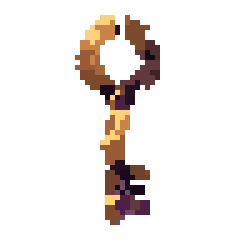
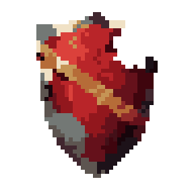
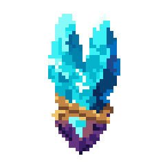

# Cursed Salvage Recovery Example

This is a representative quality benchmark, not a style prescription and not production approval. It demonstrates the recovery path after structurally valid 16x16 smoke assets were rejected as generic.

| Bound blood flask | Hooked ruin key | Bitten crimson shield | Fractured mana crystal |
|---|---|---|---|
|  |  |  |  |

## Why this reads better

- Each item starts from a damaged asymmetric silhouette instead of a stock pictogram.
- Glass, liquid, cork, brass, steel, enamel, crystal, stone, and binding use distinct planes and edge behavior.
- One amber field repair is the useful family signature; item identity remains dominant.
- The exact grid moved from 32x32 to 48x48 only after the material story and signature collided in the smaller prototype.
- ImageGen supplied semantic concept evidence. Nearest resampling, opt-in small-cluster cleanup, palette consolidation, and manual cell repair produced the exact editable grids.

The final specs use compact one-character grid rows, declare `evidence_tier: representative`, and remain reproducible without the concept images.

## Rebuild

From this directory:

```powershell
python ..\..\scripts\build_pixel_art.py pack .\specs\potion.json .\specs\key.json .\specs\shield.json .\specs\crystal.json --output .\output --title "Cursed salvage pickups 48x48" --scale 5
python ..\..\scripts\build_pixel_art.py validate .\output
python ..\..\scripts\build_pixel_art.py critique .\output
```

Read [visual-review.md](visual-review.md) for the direction decision, title-free read, and remaining limitation.
