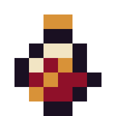
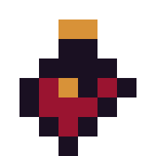
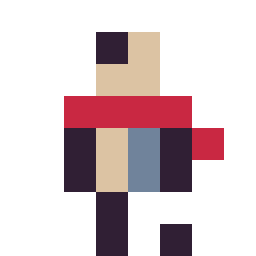
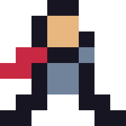
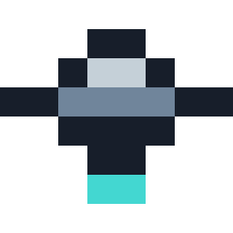
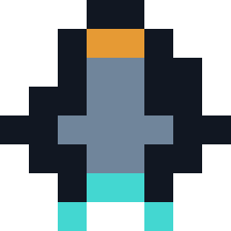

# Small-grid authored repair

This is the representative 8x8/16x16 repair benchmark. It starts from the real automatic potion drafts produced by the image route, treats them as losing baselines, searches three exact-grid directions, and rebuilds the selected direction as independent authored masters.

## Before and after

| Grid | Automatic draft | Authored repair |
|---|---|---|
| 8x8 |  |  |
| 16x16 |  |  |

The deterministic signals are not art scores, but they expose the structural cleanup:

| Grid | Baseline clusters / singletons / low-contrast boundaries | Repair clusters / singletons / low-contrast boundaries |
|---|---|---|
| 8x8 | 13 / 9 / 0.7500 | 5 / 0 / 0.1923 |
| 16x16 | 20 / 6 / 0.2556 | 12 / 2 / 0.3604 |

The 16x16 repair accepts more adjacent low-contrast glass/shadow boundaries because they form connected material planes; it wins through silhouette, liquid hierarchy, and the diagonal binding, not through optimizing one diagnostic number.

## Direction search

| A — Bound flask | B — Signal vial | C — Heart reliquary |
|---|---|---|
|  |  |  |
| Selected: broad bottle plus source-specific diagonal repair band. | Rejected: reads as battery/beacon before potion. | Rejected: reads as heart/emblem before bottle. |

Useful signature preserved: one descending amber binding crosses pale glass and red liquid.

Generic/source detail removed: microfacets, cork texture, duplicate darks, small rim lights, isolated reflections, and the source's right-side protrusion.

## Repair contract

`repair` consumes a canonical `pixel-art.json` baseline and a normal compact spec plus three required authored decisions:

```json
{
  "repair_decisions": {
    "silhouette": "what structural read changed",
    "identity_cue": "which cue receives the cell budget",
    "subtraction": "which source detail was removed"
  }
}
```

The command refuses no-op repairs, keeps the full same-size baseline grid, records changed-cell evidence, and emits a standalone before/after proof. The proof's blind-review toggle hides the artifact title and replaces the provenance captions with neutral `Sample A` / `Sample B` labels. This provenance proves authored change, not artistic acceptance; `representative` still requires [visual-review.md](visual-review.md).

## Rebuild

From this directory:

```powershell
python ..\..\scripts\build_pixel_art.py repair .\baselines\8x8.json .\repairs\potion-8.json --output .\output\8x8 --scale 24
python ..\..\scripts\build_pixel_art.py repair .\baselines\16x16.json .\repairs\potion-16.json --output .\output\16x16 --scale 12
python ..\..\scripts\build_pixel_art.py validate .\output\8x8
python ..\..\scripts\build_pixel_art.py validate .\output\16x16
python ..\..\scripts\build_pixel_art.py critique .\output\8x8
python ..\..\scripts\build_pixel_art.py critique .\output\16x16
```

Direction thumbnails remain `draft`; only the selected independent masters are `representative`. Neither label is production approval.

## Transfer fixtures

The same repair seam was also exercised on a character and a vehicle. These are deliberately labeled `fixture`, not `representative`: they prove that the workflow and provenance transfer beyond the potion, while the potion pair remains the artistic benchmark.

| Family | 32x source fixture | Automatic 8x8 | Authored 8x8 repair |
|---|---|---|---|
| Red-scarf scout |  |  |  |
| Amber scout ship |  |  |  |

The character repair turns eight color clusters and two singletons into four connected material clusters with no singletons. The ship baseline already has clean connectivity, but drops its amber canopy entirely; the repair restores that identity cue and splits the cyan exhaust into two engines. This is why diagnostics support review but cannot replace a title-hidden perceptual read.

Rebuild the transfer fixtures from this directory:

```powershell
python ..\..\scripts\build_pixel_art.py from-spec .\transfer\sources\character-32.json --output .\output\transfer\character-source --scale 1
python ..\..\scripts\build_pixel_art.py from-image .\output\transfer\character-source\pixel-art.png --size 8 --colors 4 --reconstruction auto --evidence-tier fixture --output .\output\transfer\character-automatic --scale 32
python ..\..\scripts\build_pixel_art.py repair .\transfer\baselines\character-8.json .\transfer\repairs\character-8.json --output .\output\transfer\character-authored --scale 32

python ..\..\scripts\build_pixel_art.py from-spec .\transfer\sources\ship-32.json --output .\output\transfer\ship-source --scale 1
python ..\..\scripts\build_pixel_art.py from-image .\output\transfer\ship-source\pixel-art.png --size 8 --colors 4 --reconstruction auto --evidence-tier fixture --output .\output\transfer\ship-automatic --scale 32
python ..\..\scripts\build_pixel_art.py repair .\transfer\baselines\ship-8.json .\transfer\repairs\ship-8.json --output .\output\transfer\ship-authored --scale 32
```
